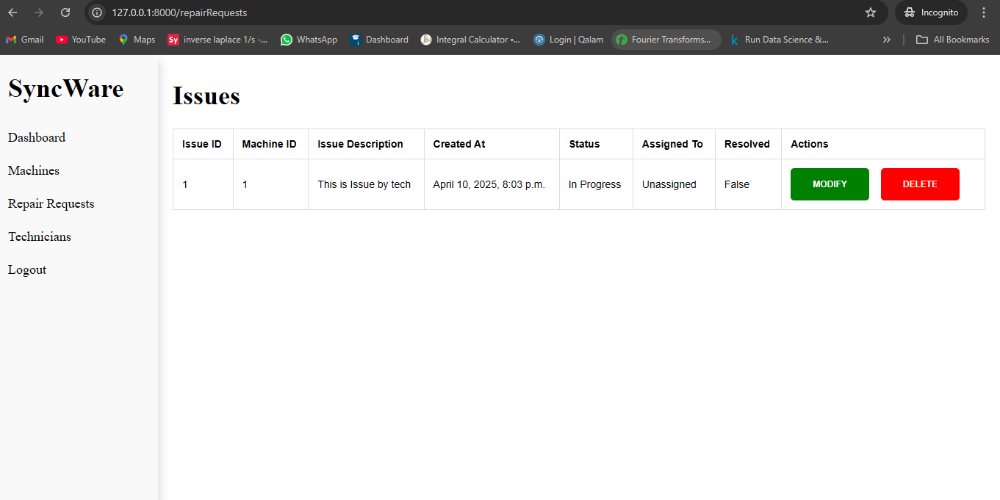

# factory-machinery-tracker

 

Overview of functionality
Registration:
•	User can register as a Manager or Technician
•	During registration, a new company record will be created based on user input
•	Manager of the company will be able to see all registered technicians under the same company
Navigation Menu:
•	Dashboard: in progress
•	Machines: list all machines under the same company
•	Repair Request: list of all the repair requests raised against the machines in the company
•	Technicians: Only managers can see this option, which will list all technicians registered in the company
Machines Page:
•	Manager:
o	New Machine Button: Only visible to managers, so only they can add machines.
o	Managers can modify and delete the machines.
o	When a machine is deleted, all corresponding issues against it will be deleted too.
•	Technician:
o	Technicians can only see the available machine, but they cannot add/modify/delete any
Technician Page:
•	Only visible to manager, list all technician and their details under the company
Repair Requests Page:
•	Manager:
o	Manager can see all the issues raised against the machines in the company.
o	They can only modify, change the request status , and delete it
•	Technician:
o	They can do all the task as Manager and also can raise new requests

Testing Machine Page :
1. You can add new Machine through queries at the moment
INSERT INTO machinery_company (id,name,email,phone,job_title) VALUES ('1','TestComapny','test@test.com','123444','manager')

INSERT INTO machinery_machine (id, name , serial_number, importance, status, company_id) VALUES ('1', 'Test Machinery' , 'SERIAL1123', '1', 'Working','1')
2. Now when you load the machines pages, you should be able to see machine & delete them

How to run a django project

1. git clone https://github.com/rnevin97/factory-machinery-tracker.git

2. Switch to git branch feature/product-website

3. First step is to create Virtual environment to setup django
    3.1  Run following commands to setup virtual environment
         python3 -m venv venv
         source venv/bin/activate (activate virtual environemnt)

4. Install all required packages/libraries
    pip install -r requirements.txt

5. run following command from dir where manage.py file is present
    python manage.py runserver

6. Server will be up running at following address 127.0.0.1:8000
